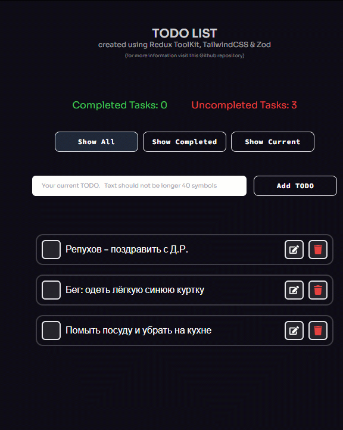

## ToDo list

### 😲 Test task description

#### Create a component that meets the requirements below.

- Adding a new record.
- A new record is added if its length is less than or equal to N characters.
- Display a list of added records.
- Switching the status of a record Completed / Not completed when clicking on its name.
- Filtering by type (all, completed, current).
- Display counter of completed and uncompleted tasks.
- Use a storage (Redux).
- For styling you can use any lib/framework, but remember UI matters.
- Please use [this linter](https://github.com/wemake-services/wemake-frontend-styleguide).

---

### ✌️ Completed task

[Live Website](https://todo-prvolt-sxidsvit.vercel.app/)



#### Used technologies:

- React.js & Vite
- Redux v.9 (Redux-ToolKit v.2 😊)
- redux-persist
- TailwindCSS
- Zod
- react-icons

#### What is in the branches of this repository

- branch _main_ - The test task has been performed using advanced features redux-toolkit v.2

```js
export const todosSlice = createSlice({
  name: 'todos',

  initialState: {
    records: getLocalStorage().records || [],
    filtering: getLocalStorage().filtering || "all",
  },

  selectors: {
    selectRecords: state => state.records,
    selectFiltering: state => state.filtering
  },

  reducers: (create) => ({
    addRecord: create.reducer((state, action) => {
      const newRecord = {
        id: new Date().getTime(),
        text: action.payload.newRecord,
        completed: false,
        editing: false
      }
      state.records?.push(newRecord)
      setLocalStorage(
        state.records,
        state.filtering,
      )
    }),
    ...
```

```js
const records = useSelector(selectRecords);
const filtering = useSelector(selectFiltering);
```

- branch _rtk-v2_ - The test task has been performed using redux toolkit

```js
export const todosSlice = createSlice({
name: 'todos',
initialState: {
  records: getLocalStorage().records || [],
  filtering: getLocalStorage().filtering || "all",
},
reducers: {
  addRecord: (state, action) => {
    const newRecord = {
      id: new Date().getTime(),
      text: action.payload.newRecord,
      completed: false,
    }
    state.records?.push(newRecord)
    setLocalStorage(
      state.records,
      state.filtering,
    )
  },
  ...
```

- branch _redux_ - The test task has been performed using classic redux

  ```js
  const reducer = (state = initialState, action) => {
  switch (action.type) {
  case ADD_RECORD:
  return {
  ...state,
  records: [
  ...state.records,
  {
  id: new Date().getTime(),
  text: action.payload.text,
  completed: false,
  },
  ],
  };
  ...
  ```

---

##### Contact with me:

[][linkedin]

[linkedin]: https://www.linkedin.com/in/sergiy-antonyuk/

##### I can't express how much I have learned from [you](https://www.youtube.com/channel/UCFq12kPZg4wTNPO7V_g3B-A) and [you](https://www.youtube.com/@CodingWithDawid)! <br> Thanks for the hard and smart work.

```

```
